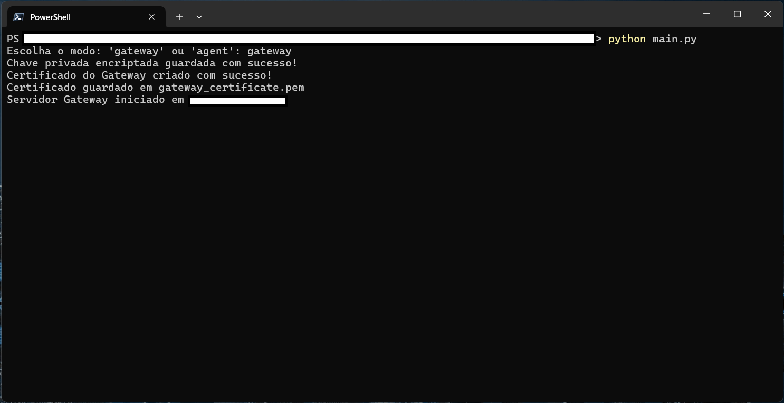
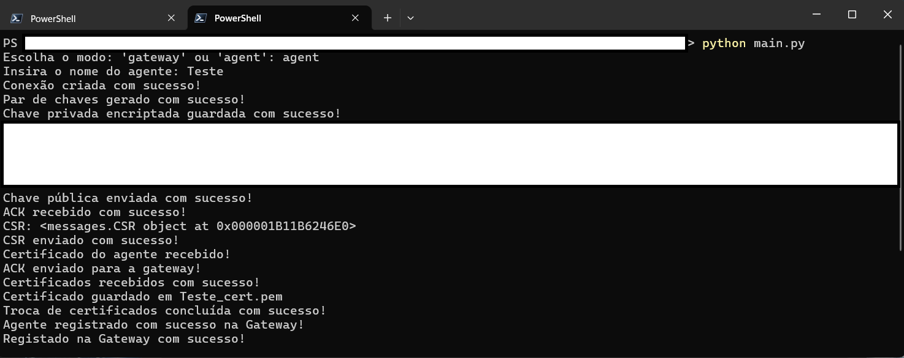

# secure_protocol

## Passos para utilizar o programa:

1 - Iniciar o programa no terminal com o comando "python main.py";

    
2 - Aparecerá um prompt a perguntar se é para iniciar em modo 'gateway' ou 'agent', é necessário ter sempre a gateway a correr num perminal para poder iniciar o agent, portanto o primeiro terminal terá de ser iniciado em modo 'gateway';

3 - Abrir um novo terminal, realizar o 1º passo e iniciar em modo 'agent', será pedido um nome e depois é realizado todo o processo de criação de par de chaves e emissão do certificado;

4 - Aparecerá um menu com as opções pretendidas, apenas as opções 2 e 3 se encontram funcionais ainda.

